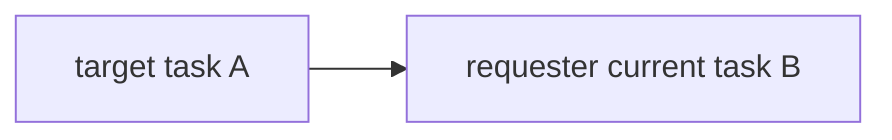
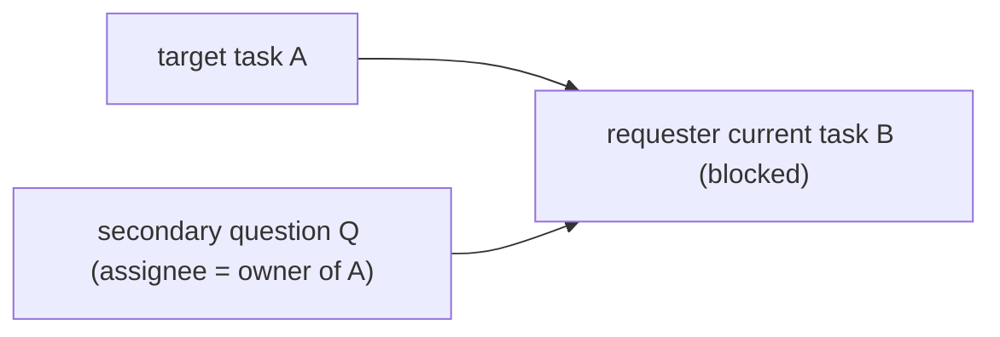
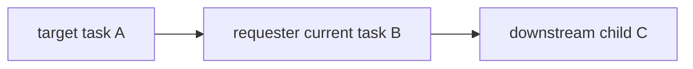
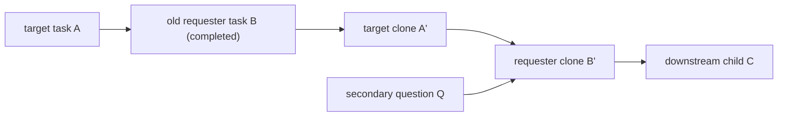

# AGENT Swarm Design

This is a minimal swarm design derived from `pseudocode-agent-team.ts`.
It intentionally keeps orchestration small: one task DAG, one submit path, one idle scheduler.

## Tool Surface

- Team-member-facing tools (both teammates and lead) are limited to exactly:
  - `ask_question`
  - `task_submit`
- External caller tool surface is limited to exactly:
  - `team_create`
- No other external team tools are exposed.
- Everything else (`claim`, `block/unblock`, dependency rewrites, idle checks, orchestration control) is system-managed runtime behavior.

## 1. Design Intent

- Keep coordination graph-based and deterministic.
- Represent waits/reviews/questions as dependencies instead of adding new state machines.
- Support exactly two question modes from the pseudocode:
  - `read`: requester waits only for an answer.
  - `edit`: requester asks for upstream rework and then resumes on a cloned task.
- Return teammates to `idle` immediately after they block/submit so the scheduler can reassign work.

## 2. Data Model

### Team

- `teamId: string`
- `teammates: Map<teammateId, Teammate>`
- `tasks: Map<taskId, Task>`

### Teammate

- `teammateId: string`
- `status: 'idle' | 'working' | 'failed'`
- `currentTaskId?: string`

### Task

- `taskId: string`
- `taskClass: 'primary' | 'secondary'`
- `assignee: teammateId`
- `instruction: string`
- `status: 'pending' | 'blocked' | 'claimed' | 'completed' | 'failed'`
- `dependsOn: taskId[]`
- `priority: number`
- `contextSessionKey: string`
- `title?: string`
- `clones: number`
- `commitId?: string`
- `onSubmit?: (reply: string) => void`

## 3. Deterministic Scheduling

- Task IDs must be monotonic (incrementing integer or sortable timestamp+counter).
- Idle claim order must be stable:
  1. higher `priority` first
  2. older creation order next
  3. lower `taskId` as final tie-breaker

## 4. Task Status Rules

- A task is unblocked when every parent in `dependsOn` is `completed`.
- `pending` means unblocked and claimable.
- `blocked` means at least one dependency is unresolved.
- `claimed` means owned by assignee and actively running.
- `completed` unblocks children.
- `failed` is terminal unless an explicit retry/clone task is created.

## 5. Operation Contracts

### `ask_question(teammateId, taskId, query, mode = 'read')`

Shared setup:

1. Resolve target task `task = getTask(taskId)`.
2. Resolve requester active task:
   - `curr_task_id = getCurrentTaskId(teammateId)`
   - `curr_task = getTask(curr_task_id)`
3. Create `new_target_query_task_id`:
   - class `secondary`
   - assignee `task.assignee`
   - status `pending`
   - `onSubmit(reply)` inserts answer into the resolved primary task session.

`read` mode:

1. Add dependency: `curr_task` depends on `new_target_query_task_id`.
2. Set `curr_task` to `blocked`.
3. Set requester teammate to `idle`.

`edit` mode (DAG rewrite):

1. Gather all children of requester current task (`getAllChildren(curr_task_id)`).
2. Remove each edge from child to old requester task.
3. Create target clone `new_target_task_id`:
   - clone of target task
   - class `primary`
   - status `blocked`
   - `dependsOn = [curr_task_id]`
4. Create requester clone `new_requester_task_id`:
   - clone of requester current task
   - class `primary`
   - status `blocked`
   - `dependsOn = [new_target_task_id, new_target_query_task_id]`
5. Reattach former children to depend on `new_requester_task_id`.
6. Mark old requester task `completed`.
7. Set requester teammate to `idle`.

### `task_submit(teammateId, taskId, reply, error)`

1. Resolve `task`.
2. If `error` exists:
   - mark task `failed`
   - call `discard_changes(task.contextSessionKey)`
   - set teammate `idle`
   - return immediately
3. If task is `primary`:
   - commit on `task.contextSessionKey`
   - store `commitId`
   - merge to team integration branch
4. If task is `secondary`:
   - call `onSubmit(reply)` when present
5. Mark task `completed`.
6. Set teammate `idle`.

### `updateTaskStatus(taskId, status)`

1. Persist task status.
2. On `completed`, inspect each child:
   - if child is now unblocked, set child to `pending`.
3. On `claimed`, resolve runtime context and start execution.

Required correctness rule:

- Child-unblock mutations must update each child task, never the completed parent task.

### `updateTeammateStatus(teammateId, status)`

1. Persist teammate status.
2. If status is `idle`, start or refresh idle checker.
3. If status is not `idle`, stop existing idle checker.

### `register_idle_task_checker(teammateId)`

- Poll interval: `333ms` (same baseline as pseudocode).
- Each tick:
  1. load current tasks
  2. filter tasks where `assignee === teammateId` and `status === 'pending'`
  3. keep only unblocked tasks
  4. sort by deterministic claim order
  5. atomically claim first candidate (`pending -> claimed`)
  6. stop checker after a successful claim

## 6. Graph Rewrite Semantics

### Read Question

Before:

After:

### Edit Question

Before:

After:

## 7. Invariants

- Task DAG stays acyclic after every mutation.
- Every `blocked` task has at least one unresolved dependency.
- Every `pending` task is unblocked.
- Only task assignee can claim or submit the task.
- A task is completed once.
- `onSubmit` side effects are idempotent.

## 8. Out of Scope for This Design

To keep this version minimal, the following are intentionally excluded unless added later:

- dedicated `lead_review`/`chore`/`pr_reviewer` reserved teammate workflows
- additional review-only task taxonomies beyond `secondary` question tasks
- extra state machines beyond task statuses + dependency graph
