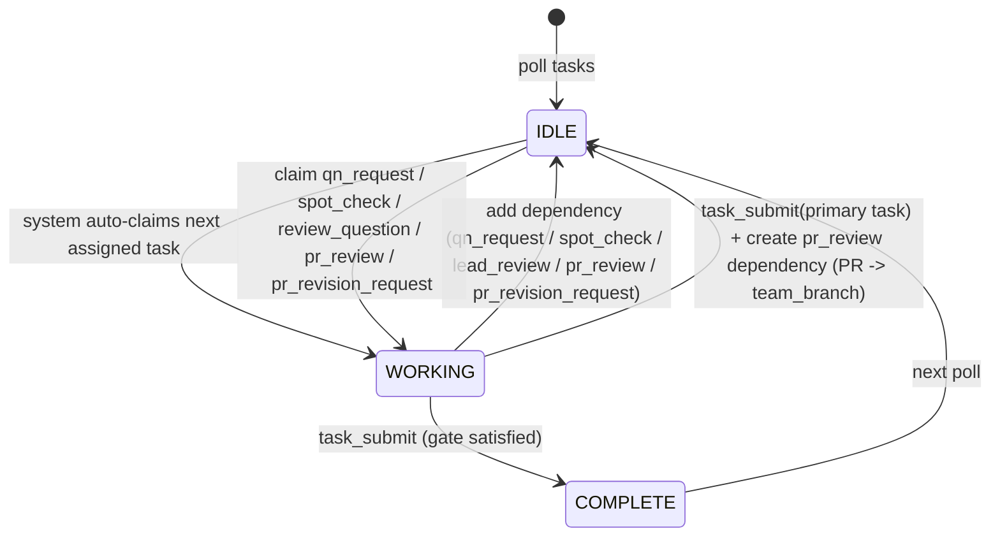
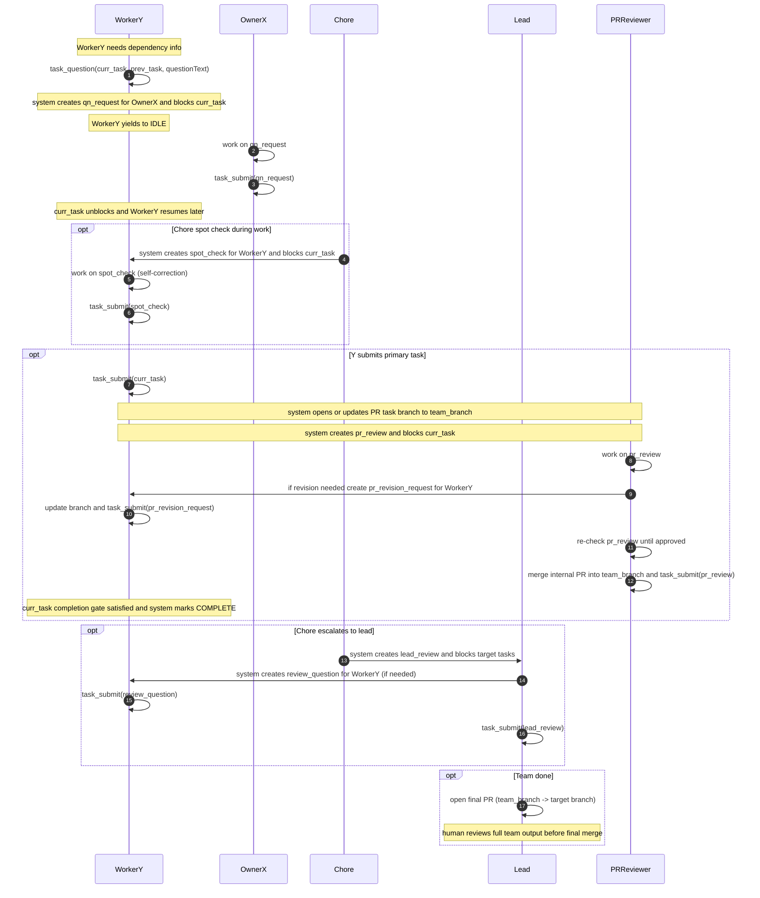
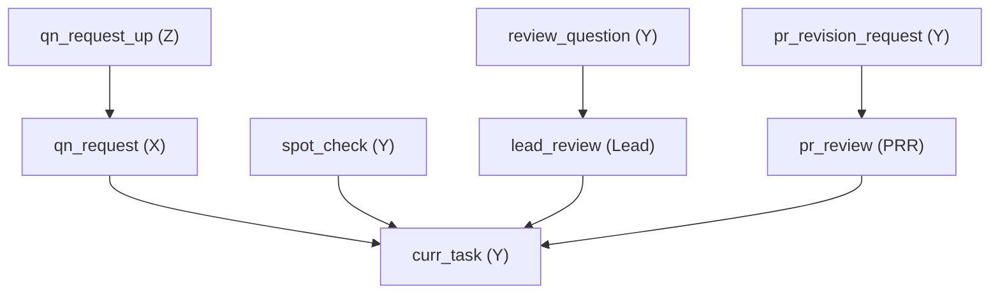

# Agent Swarm - Deterministic Questions + Self Revision + Team-Branch PR Gate

Exactly three diagrams:

1. State transition (teammate lifecycle)
2. Communication flow (cross-question, spot check, lead review, PR review)
3. Whole task graph (dependencies at a glance)

---

## 1) State Transition Diagram (Mermaid)

### State diagram semantics (leave nothing implicit)

**States**

* **IDLE**: teammate is not holding a task. The system auto-claims the next assigned pending task and delivers it.
* **WORKING**: teammate has claimed a task and is producing an answer/artifact.
* **COMPLETE**: the system has marked the task done.

**Single submit tool**

* Use `task_submit(...)` for all task submissions.

**Transitions**

* `IDLE -> WORKING (system auto-claim)`

  * System finds the highest-priority pending and unblocked task assigned to the teammate.
  * System claims it deterministically and sends it to the teammate.

* `WORKING -> COMPLETE (task_submit, gate satisfied)`

  * For non-primary tasks (`qn_request`, `spot_check`, `review_question`, `pr_review`, `pr_revision_request`), submit normally completes the task.
  * For primary tasks, completion requires internal PR merge into `team_branch`.

* `WORKING -> IDLE (task_submit on primary task before merge)`

  * System records submission artifact.
  * System opens/updates PR from task branch into `team_branch`.
  * System creates `pr_review` dependency on the primary task.
  * Primary task remains blocked until that PR is merged.

* `COMPLETE -> IDLE (next poll)`

  * After completion, teammate does not auto-continue anything.
  * Teammate returns to IDLE and polls again.

**Deterministic interruption (WORKING -> IDLE: add dependency + yield)**

* When the teammate cannot proceed (missing info, under review, correction required), they force the current task to become BLOCKED by adding a dependency and immediately yield.
* Interruption types:

  1. **Cross-question**: `task_question` creates `qn_request@DependencyOwner` and adds it as a dependency of current task.
  2. **Spot check**: Chore creates `spot_check@SameTeammate` and adds it as a dependency.
  3. **Lead review**: Chore adds `lead_review@Lead` as dependency to affected open tasks.
  4. **PR review loop**: system/reviewer creates `pr_review` and possibly `pr_revision_request` dependencies.

* After dependency is added, the current task becomes blocked and teammate goes IDLE.
* Idle callback: on transition to IDLE, system checks for ready tasks assigned to teammate and notifies immediately.

**Core policy: cross-question allowed, self-question disallowed**

* `qn_request` is for cross-owner context only.
* Teammates do not create self-question tasks against their own primary task.
* Self-correction is triggered externally via `spot_check`, `review_question`, or `pr_revision_request`.

**Team branch + PR completion contract (no new task states)**

* Every team run has one integration branch: `team_branch` (example: `codex/team/<run_id>`).
* One primary task maps to one canonical task branch: `task_id -> canonical_branch`.
* `task_submit(primary)` always submits work for that mapped task branch.
* Primary task is marked COMPLETE only when its internal PR (`canonical_branch -> team_branch`) is merged.
* If internal PR is closed unmerged, primary task remains incomplete and blocked by review dependency rules.
* Agents do not merge task branches directly to final target branch.

**Canonical + temp branch lifecycle (per teammate)**

* Canonical task branch (long-lived per primary task): `codex/task/<task_id>-<slug>`.
* Temp branch (short-lived per work/revision round): `codex/tmp/<task_id>-r<round>-<teammate_id>`.
* Teammate works on temp branch, then integrates temp -> canonical.
* PR reviewer reviews/merges canonical -> `team_branch`.
* After merge, temp branch can be deleted; canonical remains as task record branch.

**Parallel execution safety (worktree per teammate)**

* Each teammate has its own worktree path; no shared checkout across active teammates.
* A teammate executes only inside its own worktree.
* Parallelism comes from dependency graph: any pending and unblocked task can run concurrently with other unblocked tasks.

**Worktree lifecycle (required)**

* Team lead creates one worktree per active teammate at team start.
* Recommended path pattern: `.worktrees/<team_id>/<teammate_id>`.
* Reserved system teammates also get worktrees: `chore` and `pr_reviewer`.
* A teammate never switches branches in another teammate's worktree.
* Canonical and temp branches for a task are created and used only in the assignee's worktree.
* On teammate reassignment, task branch ownership moves to the new assignee worktree before new commits.
* After task completion into `team_branch`, temp branches can be deleted; worktree remains for next tasks.

**Chore teammate always runs (taskless auditor)**

* Every team includes a Chore teammate.
* Chore is taskless: it does not claim/complete tasks.
* Chore runs heartbeat audit loop and inspects teammates + task state for deterministic violations.
* Chore can create `spot_check` or escalate to `lead_review` based on objective violations.

**PR reviewer teammate (fresh-eye self revision trigger)**

* PR reviewer is external to the submitter.
* PR reviewer handles `pr_review` tasks and can request `pr_revision_request`.
* Submitter never self-approves own PR review task.
* PR reviewer merges approved task PRs into `team_branch`.

**Reserved-task primary-context resolution (idle caller only)**

* Context resolution is centralized in idle caller/dispatch path, not in Chore.
* For `lead_review`, `review_question`, `spot_check`, `pr_review`, and `pr_revision_request`, caller reads pointed task (`context_task_id`) and traverses to derive primary task context.
* For `qn_request`, caller uses asked-about pointer (`prev_task_id` / `context_task_id`) then traverses to primary task context.
* If no pointer resolves to primary task, context is `none` for that dispatch.

**Fail-early / policy guardrails**

* If teammate cannot respond without violating policy, submit failure explicitly:

  * `task_submit(task, answer="FAILED: <reason>")`

* No silent guessing and no indefinite waiting.

---

## 2) Communication Flow Diagram (Mermaid)

### Communication flow semantics (every step + edge cases)

#### A. Cross-question flow (`qn_request`) is context unblock only

* Trigger: Y needs info from dependency owner.
* Y calls `task_question(curr_task_id, prev_task_id, questionText)`.
* System creates `qn_request@X`, blocks `curr_task`, and interrupts Y to IDLE.
* X completes with `task_submit(qn_request, answer="...")`.
* Completion of `qn_request` unblocks `curr_task`.
* `qn_request` does not force resubmission of primary answer.

#### B. Self revision flow is external-triggered only

* Self-question by same worker is not allowed.
* Only external actors can trigger correction tasks:

  * Chore -> `spot_check`
  * Lead -> `review_question`
  * PR reviewer -> `pr_revision_request`

* These tasks may request correction of work, behavior, or artifacts.
* Worker performs the correction and submits the revision task.

#### C. Chore spot check behavior

* If Chore spot-check finds objective concern, Chore creates `spot_check@Worker` as dependency of current primary task.
* Worker is interrupted to IDLE and then auto-claims high-priority `spot_check`.
* Worker completes `spot_check` via `task_submit(spot_check)`.
* Primary task then resumes if no other blockers remain.
* Chore can escalate directly to `lead_review` for stronger intervention.

#### D. Lead review behavior

* Chore can create `lead_review@Lead` and block affected tasks.
* Lead may create `review_question@Worker` tasks for clarification or correction.
* Worker submits `review_question`; Lead submits `lead_review` to finalize.
* Finalization either unblocks tasks or replaces/reassigns teammate tasks.

#### E. PR review loop controls primary-task completion

* On `task_submit(primary_task)`, system opens/updates internal PR (`canonical_branch -> team_branch`) and creates `pr_review` dependency.
* PR reviewer decides:

  * **Approve/merge**: merge internal PR into `team_branch`, submit `pr_review`, primary task completes.
  * **Request revision**: create `pr_revision_request@Worker`; worker revises branch and submits revision; reviewer re-checks.

* Loop continues until merge gate is satisfied.
* No new task state is introduced; dependency graph handles blocking and retries.

#### F. Final human review after team completion

* After all primary tasks complete into `team_branch`, Lead opens one final PR from `team_branch` to final target branch.
* Human can review full team output in one place and decide final merge timing.
* This final PR does not change task-level completion semantics; it is a team-level release/review gate.

#### G. No new task states rule

* Existing states remain `IDLE`, `WORKING`, `COMPLETE`.
* Review/revision lifecycle is represented only via dependencies and `task_submit` events.

---

## Priority Rule (fully specified)

### Why priority exists

When teammate X has multiple tasks (normal work + question/review/revision), prioritize correction and review before normal execution.

### Deterministic selection policy

On each idle transition (and idle heartbeat), system auto-claims highest-priority pending and unblocked task.

Worker queues follow your required precedence:

* `spot_check > pr_review > normal work`

1. **lead_review (Lead only)**

   * safety-critical and can unblock many tasks

2. **spot_check / review_question / pr_revision_request**

   * external self-revision and correction blockers

3. **pr_review (PR reviewer only)**

   * final completion gate for primary tasks

4. **qn_request**

   * cross-question context unblock

5. **normal work tasks**

   * local deliverables

### Tie-breakers (deterministic)

If multiple tasks share same priority:

1. oldest creation time (FIFO)
2. then by task id (stable ordering)

This guarantees predictable behavior and avoids starvation.

---

## 3) Whole Task Graph (Mermaid)

Legend:

- Solid arrows are real dependencies.
- `qn_request` is cross-owner context unblock.
- `spot_check`, `review_question`, and `pr_revision_request` are external-triggered self-revision tasks.
- `pr_review` is the completion gate dependency for primary task merge into `team_branch`.
