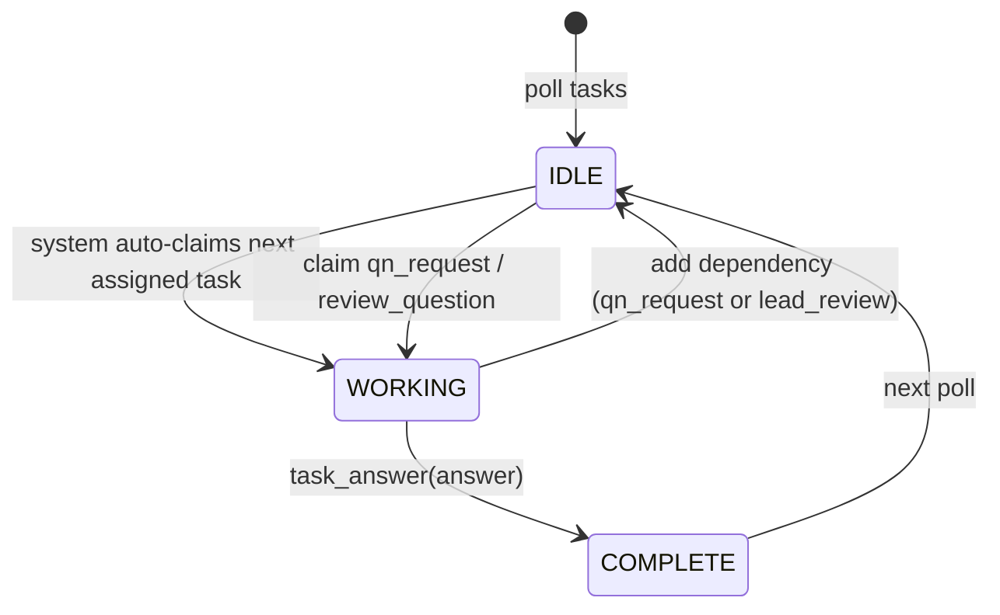
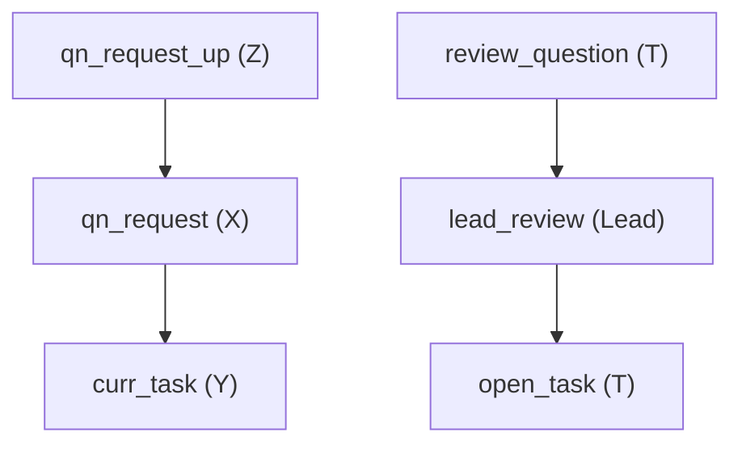

# Agent Swarm - Deterministic Questions + Lead Review

Exactly three diagrams:

1. State transition (teammate lifecycle)
2. Communication flow (question, upstream, re-ask, chore halt/review)
3. Whole task graph (dependencies at a glance)

---

## 1) State Transition Diagram (Mermaid)



### State diagram semantics (leave nothing implicit)

**States**

* **IDLE**: teammate is not holding a task. The system **auto-claims** the next assigned pending task and delivers it.
* **WORKING**: teammate has **claimed** a task and is producing an answer/artifact.
* **COMPLETE**: teammate has called `task_answer(...)` on the currently claimed task.

**Transitions**

* `IDLE -> WORKING (system auto-claim)`

  * System finds the highest-priority **pending and unblocked** task assigned to the teammate.
  * The system claims it deterministically and sends it to the teammate.
* `WORKING -> COMPLETE (task_answer)`

  * Teammate finishes the work and calls `task_answer`.
  * The system records the answer and marks the task done.
* `COMPLETE -> IDLE (next poll)`

  * After completion, teammate does not "auto-continue" anything.
  * They return to IDLE and poll again.

**Deterministic interruption (WORKING -> IDLE: add dependency + yield)**
This is the key "no waiting inside a task" rule.

* When the teammate discovers they cannot proceed (missing info, under review), they **force the current task to become BLOCKED** by adding a dependency and immediately yield.
* Two interruption types:

  1. **Question needed**: use `task_question` (system creates `qn_request@DependencyOwner` and adds it as a dependency of the current task).
  2. **Lead review needed**: `lead_review@Lead` is added as a dependency to the teammate's open tasks (done by chore).
* After the dependency is added, the current task becomes `blocked`, and the teammate goes IDLE.
* **Idle callback**: when a teammate transitions to IDLE, the system checks for ready tasks assigned to them and notifies them immediately.

**Chore teammate always runs (taskless auditor)**

* Every team must include a **Chore** teammate. This is not optional and does not depend on the user request.
* Chore is **taskless**: it does not claim or complete tasks.
* Chore runs a **heartbeat audit loop** and inspects active teammates + task state for violations.
* When a violation is found, Chore **flags the lead**, creates `lead_review`, and blocks affected tasks.

**"Answer tasks are normal work"**

* `qn_request` and `review_question` tasks are treated exactly like any other task.
* Teammates do not enter a special "answering mode" -- they receive auto-claimed tasks and complete them.

**Reserved-task primary-context resolution (idle caller only)**

* Context resolution is centralized in the idle caller / dispatch path, not in Chore.
* For `lead_review` and `review_question`, caller reads the pointed task (`context_task_id`), then traverses to derive the primary task context.
* For `qn_request`, caller uses the asked-about task pointer (`prev_task_id` / `context_task_id`), then traverses to derive the primary task context.
* If no pointer resolves to a primary task, context is `none` for that dispatch.

**Design assumption**

* Each teammate, when working across tasks, has full context of all the tasks they worked on.

**Heartbeat timers (lead, teammates, chore)**

* Lead, teammates, and Chore all respond to heartbeat polls.
* **Teammate heartbeat action**: if idle and no task arrives, respond `HEARTBEAT_OK`.
* **Lead heartbeat action**: handle any queued `lead_review` work; if nothing is pending, reply `HEARTBEAT_OK`.
* **Chore heartbeat action**: run audit checks and escalate if violations are found; otherwise `HEARTBEAT_OK`.

**Init task bootstrapping (lead only)**

* When a team is created with initial tasks, the system creates a lead-owned `init_task`.
* Lead answers `init_task` with a JSON task plan.
* The system parses the JSON, creates subtasks, and makes each subtask depend on `init_task`.
* `dependsOn` may reference task `id`s or 1-based indices from the JSON list.

**Chore audit checks (deterministic, no guessing)**

Chore flags only objective, state-based violations:

* **Stalled claimed task**: `claimedAt` exceeds stall threshold without completion.
* **Blocked but active**: task is `blocked` while assignee teammate is still `active`.
* **Missing dependency**: task depends on a task id that does not exist.
* **Invalid assignee**: task assigned to a teammate id not present in the team.
* **Stale lead_review**: lead_review pending/blocked beyond threshold.
* **Backlog overflow**: pending task count exceeds configured limit.

When any violation is found:

* Chore creates `lead_review@Lead` with violation metadata and context pointers only (no primary-context resolution in Chore).
* Chore creates `review_question@Teammate` when a responsible teammate exists.
* Chore adds `lead_review` as a dependency to the affected task(s).

**Fail-early / policy guardrails**

* If a teammate cannot answer without violating policy (e.g., "question-on-question"), they must submit `task_answer` with a clear failure reason.
* No silent guessing and no indefinite waiting.

---

## 2) Communication Flow Diagram (Mermaid)

```mermaid
sequenceDiagram
    autonumber
    participant Y as Y
    participant Lead as Lead
    participant X as X
    participant Chore as Chore
    participant T as T

    Note over Y: Y works on curr_task and needs info
    Y->>Y: task_question(curr_task, prev_task, questionText)
    Note over Y: system creates qn_request@X + blocks curr_task; Y yields to IDLE

    Note over X: X receives auto-claimed qn_request
    X->>X: work on qn_request
    X->>X: task_answer(qn_request)
    Note over Y: curr_task unblocks and Y later resumes

    opt Upstream needed by X
        X->>X: task_question(qn_request, upstream_task, questionText)
        Note over X: system creates qn_request_up@Z and blocks qn_request
    end

    opt Re-ask by Y
        Y->>Y: task_question(curr_task, prev_task, questionText)
        Note over Y: system creates qn_request_2@X
    end

    opt Chore halts teammate T
        Chore->>Lead: system creates lead_review + blocks T tasks
        Chore->>T: system creates review_question (if needed)
        T->>T: work on review_question (auto-claimed)
        T->>T: task_answer(review_question)
        Lead->>Lead: task_answer(lead_review)
    end
```

### Communication flow semantics (every step + edge cases)

This diagram intentionally shows **no direct lead->teammate coordination** except creating tasks. Teammates discover tasks by polling.

#### A. Base question flow (Y asks, lead routes, X answers)

**A1. Y raises a question deterministically**

* Trigger: Y is working on `curr_task` and needs information that must come from work history (e.g., `prev_task`).
* Y uses **one tool action**:

  1. `task_question(curr_task_id, prev_task_id, questionText)`

     * Minimal metadata should include:

       * `curr_task_id`
       * `prev_task_id` or a pointer to the upstream task/context
       * `questionText`
       * optional: expected answer format (bullet list, code snippet, file path, etc.)
* The system then **deterministically**:

  * Creates `qn_request@X` where X is the current owner of `prev_task`.
  * Adds `qn_request` as a dependency of `curr_task` (blocking it).
  * **Hard-interrupts** Y (ESC-style) and transitions Y to **IDLE** immediately.
* `task_question` only targets **dependency tasks**: `prev_task_id` must already be listed in `curr_task.dependsOn`.

**A2. Dependency owner answers (deterministic)**

* X claims/handles `qn_request` directly:

  1. Call `task_answer(qn_request, answer="<actual answer>")`.
  2. The system marks `qn_request` completed.
  3. Completion of `qn_request` unblocks `curr_task`.

**A3. X answers by polling**

* X idle loop sees `qn_request` as pending and high priority.
* System auto-claims `qn_request` for X; X answers, attaches artifacts if needed, and completes it.
* Completion of `qn_request` automatically unblocks `curr_task`.

**A4. Y resumes later**

* Y does not "wait". Y returns to IDLE, and on the next poll sees `curr_task` unblocked and continues.

#### B. Upstream chaining (X is blocked answering)

**Rule: Lead does not decide upstream; X does.**

* If X cannot answer `qn_request` without information from `prev_prev_task`, X performs the same deterministic pattern:

  1. `task_question(qn_request_id, prev_prev_task_id, questionText)`
  2. System creates `qn_request_up@Z`, blocks `qn_request`, and returns X to IDLE.
* When upstream answer completes, it unblocks X's `qn_request`, then that unblocks Y's `curr_task`.

This produces a clean dependency chain:

* `qn_request_up@Z -> qn_request@X -> curr_task@Y`

No cycles and no hidden coordination.

#### C. Re-ask loop (answer not satisfactory)

**Rule: Y controls satisfaction; re-ask is a new question.**

#### D. Chore always runs (taskless audit)

* The Chore teammate is always present, **even without user request**.
* Chore does not claim tasks. It runs a heartbeat audit loop over teammates + tasks.
* If Chore detects issues, it triggers `lead_review` and blocks affected tasks as shown in the sequence diagram.

* If Y finds X's answer insufficient, Y repeats the exact same pattern via `task_question`:

  * Ask again with improved question text / acceptance criteria
  * System creates a new `qn_request` and re-blocks `curr_task`
* History is preserved: the old `qn_request` remains completed; new one becomes the blocker.

#### D. No question-on-question (outside the dependency graph)

* If X thinks the question is unclear and the missing info is **not** a dependency task, X must either:

  * Answer based on best available context from `prev_task`, OR
  * Fail the task: `task_answer(qn_request, answer="FAILED: <reason>")`
* X must not create a "clarify question" task back to Y unless it targets a dependency task.

#### E. Multiple blockers in parallel

* If `curr_task` needs multiple missing inputs, Y can create multiple question requests.
* `curr_task` stays blocked until **all** linked `qn_request*` tasks complete.

#### F. Chore halt + lead review (hard stop)

Your rule: **Chore can halt operation deterministically** through task/dependency changes only.

**F1. Chore triggers review**

* Chore does two things:

  1. Deterministic halt via graph:

     * System creates `lead_review@Lead` with `{target:T, reason}`
     * System adds `lead_review` as a dependency to each open task of T
* Result: T's tasks become blocked; T goes IDLE and sees they are "under review" because tasks are blocked by `lead_review`.

**F2. Lead conducts review using review_question tasks**

* The system creates one or more `review_question@T` tasks when needed.
* `lead_review` depends on the `review_question*` tasks.
* T answers each `review_question` normally (auto-claim -> complete).

**F3. Lead finalization**

* When all `review_question*` complete, `lead_review` becomes unblocked.
* Lead then:

  * completes `lead_review` (accept/unblock), OR
  * fires/replaces T and recreates/reassigns T's blocked tasks.

**Fail-early in review**

* If T does not respond or responses are unusable, lead can complete `lead_review` with failure and proceed to replacement.

---

## Priority Rule (fully specified)

### Why priority exists

When a teammate X has multiple tasks (e.g., A->X, B->X, C->X) plus question/review work, we want X to prefer tasks that unblock others.

### Deterministic selection policy

On each idle transition (and idle heartbeat), the system auto-claims the highest-priority *pending & unblocked* task:

1. **lead_review (Lead only)**

   * Blocks multiple tasks and is safety-critical.
2. **review_question / qn_request**

   * Unblocks other teammates' work (reduces global blockage).
3. **Normal work tasks (A/B/C)**

   * Progress local deliverables.

### Tie-breakers (deterministic)

If multiple tasks share the same priority, break ties by:

1. oldest creation time (FIFO)
2. then by task id (stable ordering)

This guarantees predictable behavior and avoids starvation.

---

## Priority Rule

Deterministic pick order when multiple tasks exist:

1. lead_review (highest)
2. review_question / qn_request (high)
3. normal work tasks (lower)

---

## 3) Whole Task Graph (Mermaid)



Legend:

- Solid arrows are real dependencies.
- `qn_request` is the real blocking task and answer artifact.
